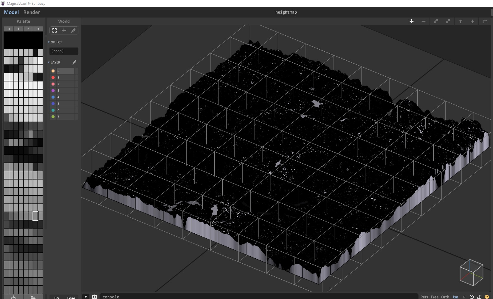

[](nicolas.perrier2@numericable.fr)

# What is FileToVox ? 

FileToVox is a console program which allow you to convert a file into a vox file (Magicavoxel).

Current files support: 
- .schematic
- .png
- .asc (Esri ASCII raster format)
- .binvox
- .qb (Qubicle)

It support world region, so you can convert a terrain bigger than 126^3 voxels ! 


# How use it ? 

- You need to open a console (like cmd or Powershell in Windows)
- Go to the emplacement of the binary
- Lanch the command

## Windows
`FileToVox.exe --i [INPUT] --o [OUTPUT]`

## MacOS or Linux

`FileToVox --i [INPUT] --o [OUTPUT]`

If you have an error like 'Unable to load DLL 'libgdiplus', try this command : `brew install mono-libgdiplus`

[INPUT] refer to a input filepath (mandatory)
[OUTPUT] refer to the destination path (mandatory)

## Options

```
--h,        -help                     show this message and exit
--v,        -verbose                  enable the verbose mode
--w,        -way=VALUE                the way of schematic (0 or 1), default value is 0
--iminy,    -ignore-min-y=VALUE       ignore blocks below the specified layer (only for schematic file)
--imaxy,    -ignore-max-y=VALUE       ignore blocks above the specified layer (only for schematic file)
--e,        -excavate                 delete all blocks which doesn't have at lease one face connected with air
--s,        -scale=VALUE              increase the scale of each block (only for schematic file)
--hm        -heightmap=VALUE          create voxels terrain from heightmap with the specified height (only for PNG file)
--c,        -color                    enable color when generating heightmap (only for PNG file)
--cm,       -color-from-file          load color from another file
 ```
 
 # Installation 
 
 Go to the [release](https://github.com/Zarbuz/SchematicToVox/releases) page and download the lastest version of FileToVox. Be sure to download the binary and not the source code. 
Then extract the content of zip file in the folder of your choice.

# Examples

`FileToVox.exe --i heightmap.png --o heightmap --hm 100`

## Input file


## Ouput file


## Render


