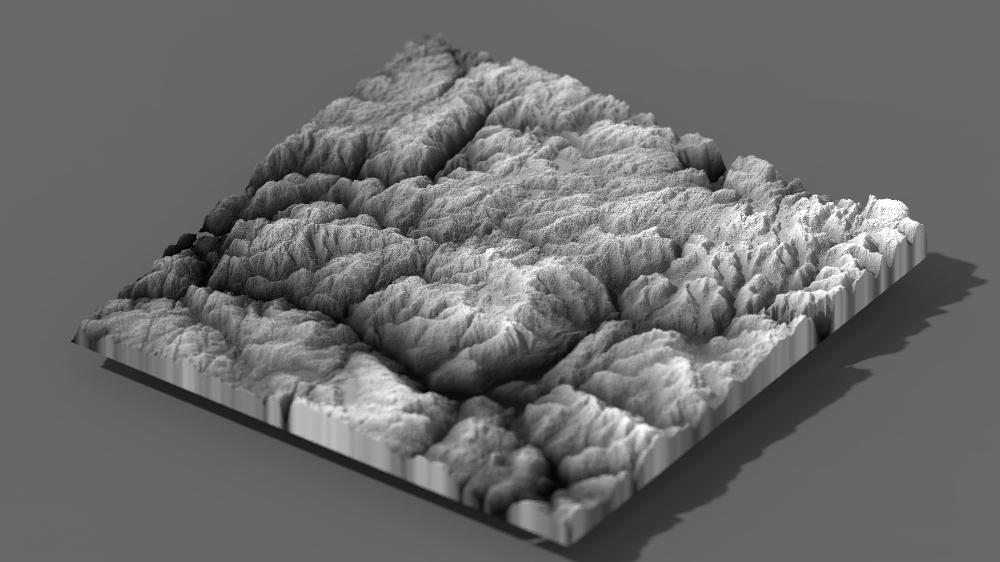

# What is FileToVox ? 

FileToVox is a console program which allow you to convert a file into a vox file (Magicavoxel).

Current files support: 
- .schematic
- .png
- .asc (Esri ASCII raster format)
- .binvox
- .obj
- .qb (Qubicle)
- .ply (Binary and ASCII)
- .xyz (X Y Z R G B)

It support world region, so you can convert a terrain bigger than 126^3 voxels ! 


# How use it ? 

- You need to open a console (like cmd or Powershell in Windows)
- Go to the emplacement of the binary
- Launch the command : `./FileToVox.exe --i [INPUT] --o [OUTPUT]`
- [INPUT] refer to a input filepath (mandatory)
- [OUTPUT] refer to the destination path (mandatory)

## MacOS or Linux

If you have an error like 'Unable to load DLL 'libgdiplus', try this command : `brew install mono-libgdiplus`

## Options

```
--h,        -help                     show this message and exit
--v,        -verbose                  enable the verbose mode
--w,        -way=VALUE                the way of schematic (0 or 1), default value is 0
--iminy,    -ignore-min-y=VALUE       ignore blocks below the specified layer (only for schematic file)
--imaxy,    -ignore-max-y=VALUE       ignore blocks above the specified layer (only for schematic file)
--e,        -excavate                 delete all blocks which doesn't have at lease one face connected with air
--s,        -scale=VALUE              set the scale
--hm        -heightmap=VALUE          create voxels terrain from heightmap with the specified height (only for PNG file)
--c,        -color                    enable color when generating heightmap (only for PNG file)
--cm,       -color-from-file=VALUE    load color from another file
--gs        -grid-size=VALUE          set the grid size (only for OBJ file)
--slow=VALUE                          use a slower algorithm (use all cores) to generate voxels from OBJ but best result (value should be enter 0.0 and 1.0 (0.5 is recommended)
 ```
 
# Installation 
 
Go to the [release](https://github.com/Zarbuz/SchematicToVox/releases) page and download the lastest version of FileToVox. Be sure to download the binary and not the source code. 
Then extract the content of zip file in the folder of your choice.

## config.txt

You can edit the colors of the palette used when generating from schematic file in `schematics/config.txt`

# Examples

```
./FileToVox.exe --i heightmap.png --o heightmap --hm 100
./FileToVox.exe --i heightmap.png --o heightmap --hm 100 --e --cm colors.png
./FileToVox.exe --i cloud.ply --o cloud --scale 20
```

## Notes

For PNG files, you can't load pictures bigger than 2016x2016 px

## Input file


## Ouput file


## Render


